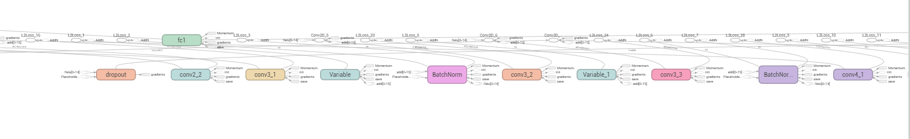

### VGG folder

+ VGG19 and VGG_16&14.ipynb can reproduct the tensorboard and network training.
+ VGG_14&16_batch_normalize.ipynb list the trainning error and test error with sample output

+ Below is part of the VGG_19 structure

  
+ Below is the test accuracy and loss of the three VGG network

